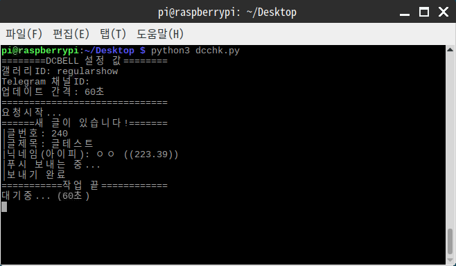

# dcbell-python


디시인사이드(dcinside) 갤러리의 새 글을 실시간으로 텔레그램 채널봇을 통해 알려주는 스크립트

스크립트 테스트 링크: https://dcbell-test.pbjdev.repl.run/

포크 코드: https://github.com/pdjdev/dcbell-python
(글, 댓글 키워드 알림이 필요한 경우 위 리포지토리를 참고하세요)

## 사용 방법

1. BotFather를 통해 텔레그램 로봇을 생성하고, 알림을 받기 원하는 공개 채널도 생성하여 API 토큰과 채널 링크(@포함)를 준비합니다.

```
# 텔레그램 설정
TelAPI = "123456789:aaaaaaaaaaaaaaaaaaaaaaaaaaaaaaaaaaa" # 텔레그램 봇키
TelChan = "@channelid" # 주소
# 갤러리 설정 {'갤러리ID': 최근 글 번호}
gall = {'gall1':0, 'gall2':0}
updTime = 60 # 업데이트 주기 (초)
```
2. 1.의 내용을 바탕으로 main.py 에서 위의 값을 원하는 설정으로 바꿉니다.
갤러리는 딕셔너리 형식이므로 {'gall1': 111, 'gall2':222, 'gall3':345, ...} 와 같은 식으로 1개 이상 적어주시면 됩니다.
<br/><sup>업데이트 주기(updTime)는 초 단위이며, 부하를 막기 위해 최소 1분 이상으로 지정해 주시기 바랍니다.</sup> <br/><br/>


3. 알림 받을 채널 링크로 가 1.에서 생성했던 봇을 관리자로 추가한 뒤, 코드를 실행하여 알림이 정상적으로 오는지 확인합니다.
<br/><br/>


