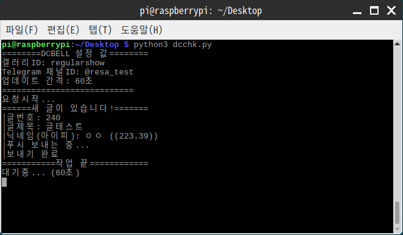

# dcbell-python


디시인사이드(dcinside) 갤러리의 새 글을 실시간으로 텔레그램 채널봇을 통해 알려주는 스크립트

## 사용 방법
1. BotFather를 통해 텔레그램 로봇을 생성하고, 알림을 받기 원하는 공개 채널도 생성하여 API 토큰과 채널 링크(@포함)를 준비합니다.<br/><br/>
```
gallid = "galleryid" #갤러리 ID 입력
TelAPI = "123456789:aaaaaaaaaaaaaaaaaaaaaaaaaaaaaaaaaaa" #텔레그램 봇키
TelChan = "@channelid" #채널 주소
updTime = 60
```
2. 1.의 내용을 바탕으로 main.py 에서 위의 값을 원하는 설정으로 바꿉니다. [^1] <br/><br/>
```
html = urlopen('https://gall.dcinside.com/mgallery/board/lists?id=' + gallid).read()
```
3. 중요!! 현재 코드에서는 마이너 갤러리의 일반 글 기준으로 URL이 설정되어 있습니다. 정식 갤러리의 알림을 받고 싶으시거나 개념글, 특정 키워드 검색글 등을 받고 싶으신 경우 위 줄의 URL을 고쳐 주세요.<br/><br/>
4. 알림 받을 채널 링크로 가 1.에서 생성했던 봇을 관리자로 추가한 뒤, 코드를 실행하여 알림이 정상적으로 오는지 확인합니다.<br/><br/>

---

[^1]: updTime은 초 단위이며, 부하를 막기 위해 최소 1분 이상으로 지정해 주시기 바랍니다.
 


